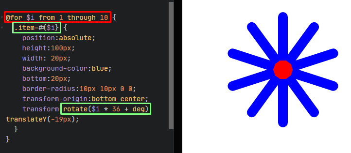

# SASS/SCSS Notları.

| Sayı |             Konu              |
| ---- | :---------------------------: |
|  001 | [Degisken](#değişken)       |
|  002 | [İç içe yazma](#iç-içe-yazma)       |
|  003 | [Modüler](#modüler)       |
|  004 | [Mixins (karışımlar)](#mixins-karışımlar)       |
|  005 | [Devralma extend/inheritance](#devralma-extendinheritance)       |
|  006 | [Döngüler ( @For )](#döngüler-for)       |

<br/><br/>
## Değişken
> Değişken oluşturma ve tanımlama.

```scss
$text-color: #FFFFFF;
$bg-color: #222222;

div{
  color:$text-color;
  background:$bg-color;
}

```
<br/><br/>
## iç içe yazma
> sass ile iç içe eleman yapısını kunlanabilirsiniz.

```scss
div{
  color:#222;
  background:#eee;
  
  &:hover{
    background:#333;
  }
  &:active{
    background:#212121;
  }
  
  & > .item{
    color:#fff;
    
    & > img{
      width:200px;
      height:200px;
    }
  }
  
}

```
<br/><br/>
## Modüler
> sass  modül yapısı sayesinde başka sass dosyalarını ana sass dosyasına @use ile dahil edebilirsiniz bu sayede böl yarçala yaparak rahat kod yazabilirsiniz.

```scss
// _farklidosya.scss
$text-color: #FFFFFF;
$bg-color: #222222;

div{
  color:$text-color;
  background:$bg-color;
}
```


```scss
// ana.scss
@use 'farklidosya';

.div {
  background-color: farklidosya.$bg-color;
  color: #fff;
}
```
<br/><br/>
## Mixins (karışımlar)
> sass içerisindeki Mixins yapısı sayesinde kod tekrarından kurtulun! js içerisindeki fonksiyonlara benzetebilirsiniz.

```scss
@mixin tema($degisken: #222) {
  background: $degisken;
  box-shadow: 0 0 1px rgba($degisken, .25);
  color: #fff;
}

.bilgi {
  @include tema;
}
.uyarı {
  @include tema($degisken: red);
}
.basarili {
  @include tema($degisken: green);
}
```
<br/><br/>
## Devralma extend/inheritance
> Devralma extend/inheritance yapısı başka elemanların özeliğini istediğiniz elemana taşımanıza olanak sağlar ayrıca kendiniz bir değişken yapısı oluşturup başka bir elemana aktarabilirsiniz. [CodePen örneği](https://codepen.io/fatihydrm/pen/LYQmrrp)

```scss
%patern {
  display:flex;
  justify-content:center;
  align-content:center;
}
.patern{
  gap:10px;
  padding:10px;
  background:#eee;
  @extend %patern;
}

.child-1{
  height:100px;
  width:100px;
  background-color:#222;
  border: 2px solid red;
  padding: 10px;
  color: #eee;
  display:grid;
  place-items:center;
}
.child-all{
  @extend .child-1;
}
```
<br/><br/>
## Operatörler
> Operatörler size çarpma toplama gibi özelikler kunlanmanızı sağlar. ( + , - , * , / , % ) [CodePen Örneği](https://codepen.io/fatihydrm/pen/KKQReOJ)

```scss
.container {
  display: flex;
  background-color:#eee;
  height:100px;
  gap: 10px;
  justify-content: space-between;
}

.one {
  width: 100 + 100+px;
  background: red;
  height: 100%;
}

.two{
  width: 100 * 2+px;
  background:green;
}
.three{
  width: 400 - 200+px;
  background:blue;
}

.four{
  width: 400 / 2+px;
  background:yellow;
}
```

<br/><br/>
## Döngüler (@For)
> sass for döngüsü ile animasyon renk genişlik vs bir çok şeyi orantılı olarak düzenleyebilirsiniz Örnek resimi ekte bulabilirsiniz. [CodePen linki](https://codepen.io/fatihydrm/pen/GRQdBNx?editors=0100)



```scss
@for $i from 1 through 10 {
  .item-#{$i} {
    position:absolute;
    height:100px;
    width: 20px;
    background-color:blue;
    bottom:20px;
    border-radius:10px 10px 0 0;
    transform-origin:bottom center;
    transform:rotate($i * 36 + deg) translateY(-19px);
  }
}
```

<br/><br/><br/><br/>
# [Daha Fazlası için sass dökümantasyonuna bakabilirsiniz](https://sass-lang.com/documentation/)
